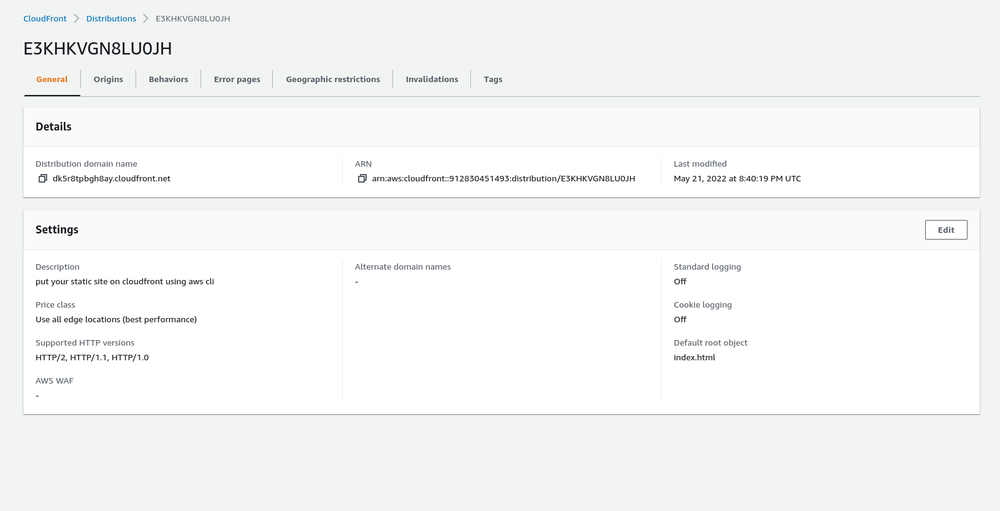
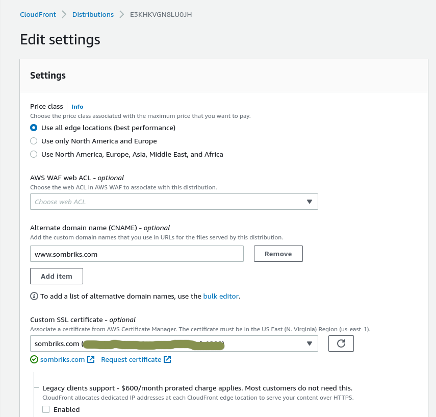

# Static site from aws s3

Static sites on amazon s3 are dead simple.

## Before begin

See this article in order to
[configure aws cli](https://sombriks.com.br/#/blog/0032-introduction-to-aws-cli.md).

## Amazon s3 setup

Create the bucket is easy, but you need to provide a policy file to grant proper
access to it: [s3-bucket-policy.json](s3-bucket-policy.json)

```bash
# Create the bucket
aws s3api create-bucket --bucket 2022-my-static-bucket

# set access policies
aws s3api put-bucket-policy --bucket 2022-my-static-bucket --policy file://s3-bucket-policy.json

# put the site resources there
aws s3 cp ./site s3://2022-my-static-bucket --recursive

# enable website mode
aws s3 website s3://2022-my-static-bucket/ --index-document index.html
```

[Visit site](http://2022-my-static-bucket.s3-website-us-east-1.amazonaws.com/)

## Cloudfront setup

At first, it was not working. But a simple email to amazon support enabled my
account to use cloudfront

Issue the following command:

```bash
aws cloudfront create-distribution --distribution-config file://cloudfront-distribution-config.json
```

Make sure to point out the correct s3 bucket address inside the
[distribution config file](cloudfront-distribution-config.json)

## DNS setup

Setup a [domain name](https://us-east-1.console.aws.amazon.com/route53/home#DomainListing:).

Setup a [ssl certificate](https://us-east-1.console.aws.amazon.com/acm/home?region=us-east-1#/certificates/list)
for this domain.

For this one i only found the steps to do that using aws web console.

Go into *My distribution details* and hit edit:



Select alternate domain name and the certificate:



And we're done!

## Cleanup

Delete the alias A or AAAA record on
[hosted zones](https://us-east-1.console.aws.amazon.com/route53/v2/hostedzones#).

Delete cloudfront distributions:

```bash
# find distributions id
$ aws cloudfront list-distributions | jq '.DistributionList | .Items[].Id'
"EQ0X2UA6ANOT"
"E3KHKVGN8LU0JH"

# find distributions versions and get configs for modification
$ aws cloudfront get-distribution-config --id EQ0X2UA6ANOT | jq ".ETag"
"E264VFWPIZFXUS"
$ aws cloudfront get-distribution-config --id EQ0X2UA6ANOT | jq ".DistributionConfig" > config1.json

$ aws cloudfront get-distribution-config --id E3KHKVGN8LU0JH | jq ".ETag"
"E2ZX4G05HCUMJ6"
$ aws cloudfront get-distribution-config --id E3KHKVGN8LU0JH | jq ".DistributionConfig" > config2.json
```

Now edit the `"Enabled"` attribute in each config to `false`. You can't delete
the distributions without disabling them.

### disable distributions

```bash
aws cloudfront update-distribution --distribution-config file://config1.json --id EQ0X2UA6ANOT --if-match E264VFWPIZFXUS
aws cloudfront update-distribution --distribution-config file://config2.json --id E3KHKVGN8LU0JH --if-match E2ZX4G05HCUMJ6
```

### delete distributions

```bash
aws cloudfront delete-distribution --id EQ0X2UA6ANOT --if-match E264VFWPIZFXUS
aws cloudfront delete-distribution --id E3KHKVGN8LU0JH --if-match E2ZX4G05HCUMJ6
```

For course, there is always the option to delete distributions
[using the web console](https://console.aws.amazon.com/cloudfront/v3/home?skipRegion=true#/distributions).

### Delete de bucket

First cleanup the bucket and then get rid of it:

```bash
aws s3 rm s3://2022-my-static-bucket/ --recursive
aws s3api delete-bucket --bucket 2022-my-static-bucket
```
